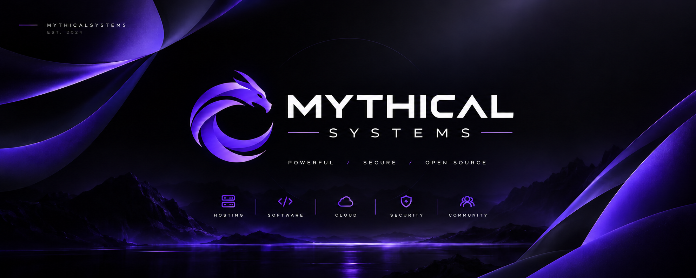

  

    

  # MythicalSystems

  **Crafting powerful open-source solutions for the global developer community.**

  
  

---

### About Us

MythicalSystems is an open-source development organization focused on building modern, efficient, and accessible applications, hosting tools, and management dashboards for the community.

* **Founded & Led by:** [@NaysKutzu](https://github.com/NaysKutzu)
* **Official Website:** [mythical.systems](https://www.mythical.systems)
* **Community Discord:** [discord.mythical.systems](https://discord.mythical.systems)

---

### Support & Connect

If you love our open-source tools and want to support ongoing infrastructure and development:

* 💬 **Discord:** [Join our community](https://discord.mythical.systems) to get support, report issues, or connect with other developers.

---

*All projects are under copyright © MythicalSystems 2021–2026*

